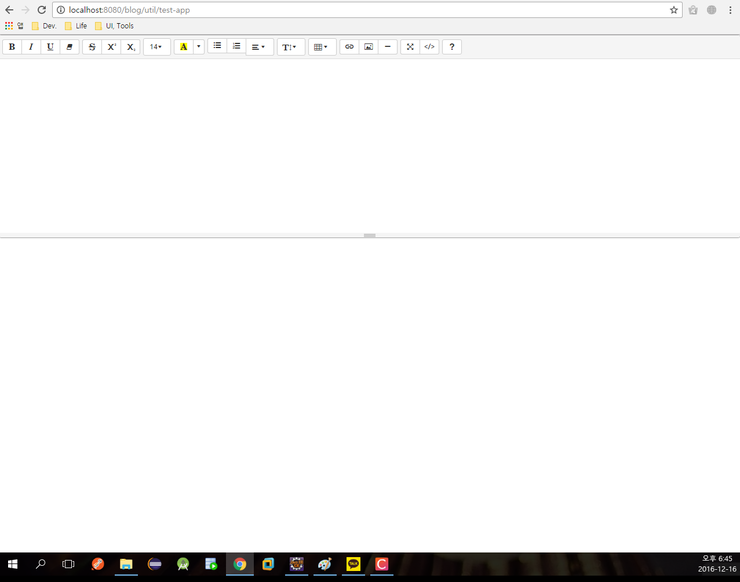

WYSIWYG 에디터 Summernote 사용방법을 정리합니다.
<!--more-->
###### 1. CDN 추가
```html
<link href="http://cdnjs.cloudflare.com/ajax/libs/summernote/0.8.2/summernote.css" rel="stylesheet">
<script src="http://cdnjs.cloudflare.com/ajax/libs/summernote/0.8.2/summernote.js"></script>
```

###### 2. 에디터로 사용할 div 영역 생성
```html
<!DOCTYPE html PUBLIC "-//W3C//DTD HTML 4.01 Transitional//EN" "http://www.w3.org/TR/html4/loose.dtd">
<html>
    <head>
        <meta http-equiv="Content-Type" content="text/html; charset=UTF-8">
        <%@ include file="/WEB-INF/include/app-header.jspf" %>
        <title>Insert title here</title>
    </head>
    <body>
        <div id="summernote"></div>
    </body>
</html>
```

###### 3. 에디터 생성
```js
$(document).ready(function(){
    var toolbar = [
        ['style', ['bold', 'italic', 'underline', 'clear']],
        ['font', ['strikethrough', 'superscript', 'subscript']],
        ['fontsize', ['fontsize']],
        ['color', ['color']],
        ['para', ['ul', 'ol', 'paragraph']],
        ['height', ['height']],
        ['table', ['table']],
        ['insert', ['link', 'picture', 'hr']],
        ['view', ['fullscreen', 'codeview']],
        ['help', ['help']]
    ];

    var setting = {
        height : 300,
        minHeight: null,
        maxHeight: null,
        focus : true,
        lang : 'ko-KR',    
        toolbar : toolbar
    };

    $('#summernote').summernote(setting);
});
```

간단하다.  

toolbar 변수는 에디터 상단에 어떤 버튼들을 보여줄지 설정하는 것이다.  



###### 4. 에디터에 작성한 내용 HTML코드로 가져오기
```js
var htmlStr = $('#summernote').summernote('code');
```

기타 더 다양한 설정 및 활용방법은 [Summernote 공식 홈페이지](https://summernote.org/)에서 확인가능하다.
