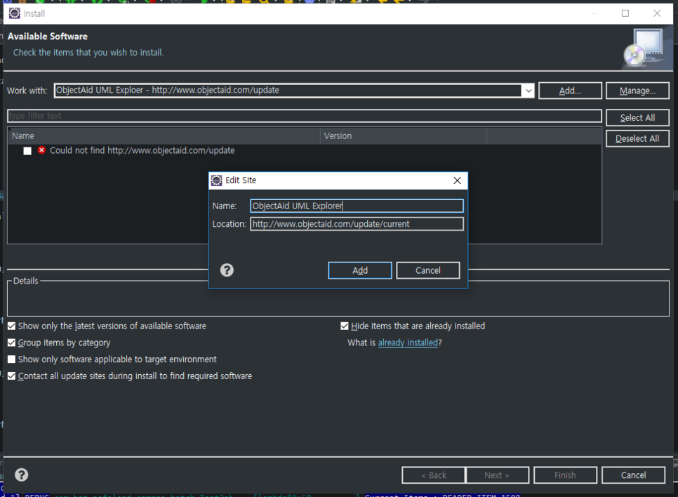
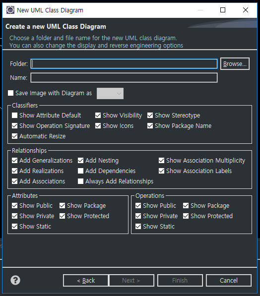
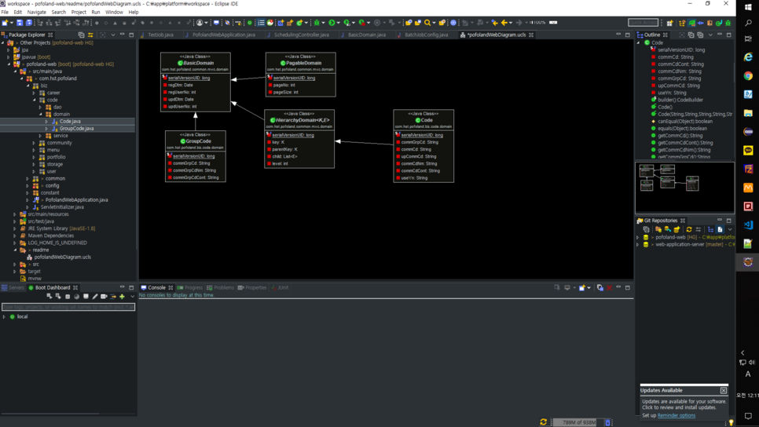

1. Help > Install New Software로 Install 팝업창 진입

2. Add 버튼 클릭하여 Name : ObjectAid UML Explorer, Location :  [http://www.objectaid.com/update/current](https://github.com/rzwitserloot/lombok/issues/1703) 입력
<!--more-->

3. Pending이 완료되면 체크 박스 선택 후 Next 버튼으로 설치하면 설치 완료

4. File > New > Other 에서 ObjectAid Class Diagram 검색 후 클릭

5. Folder는 Browse 버튼을 클릭하여 다이어그램을 만들 프로젝트 생성, Name은 다이어그램 파일명 입력후 Finish 버튼 클릭하면 Name으로 빈 다이어그램이 생성됨.

6. 프로젝트 탐색기의 Java 클래스 파일을 다이어그램에 Drag하여 놓으면 자동으로 다이어그램이 생성된다.

