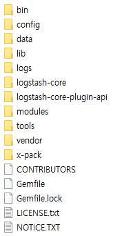
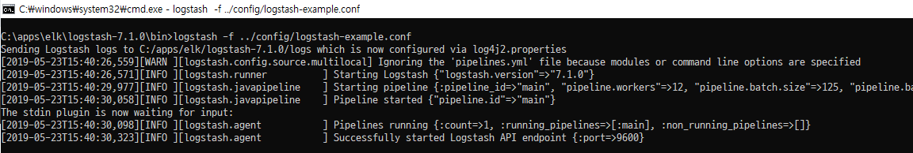
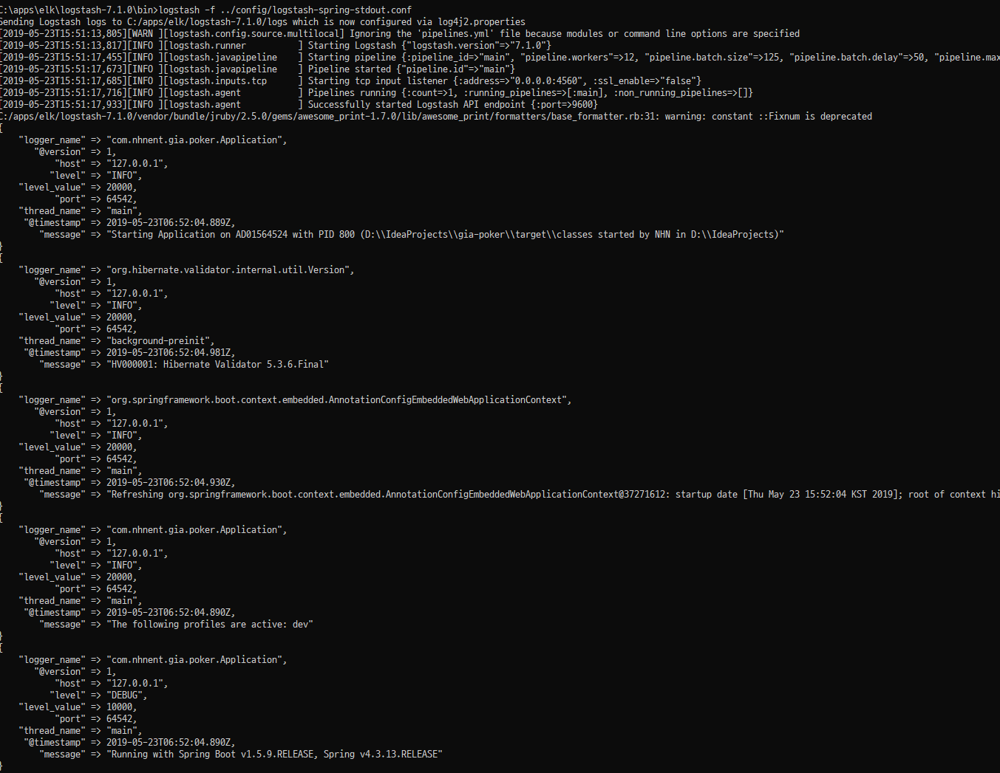
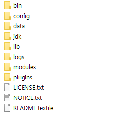
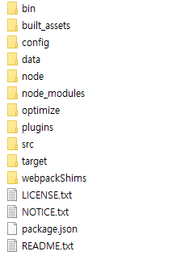
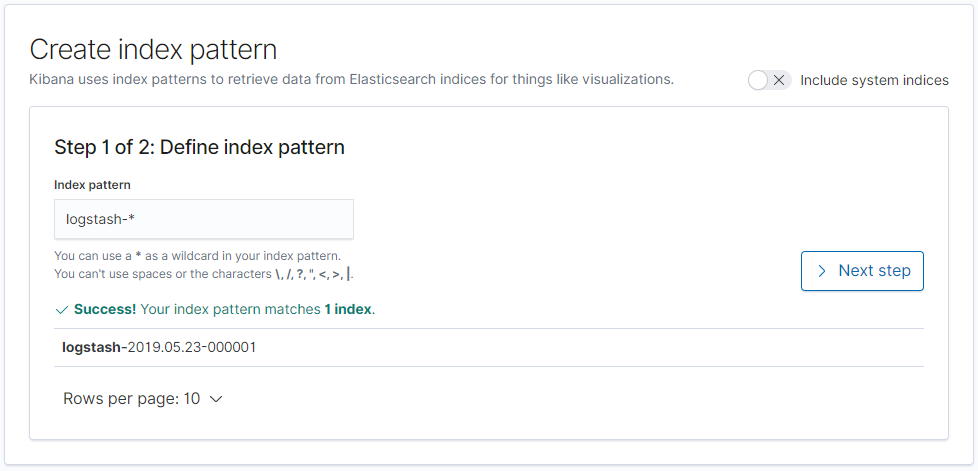
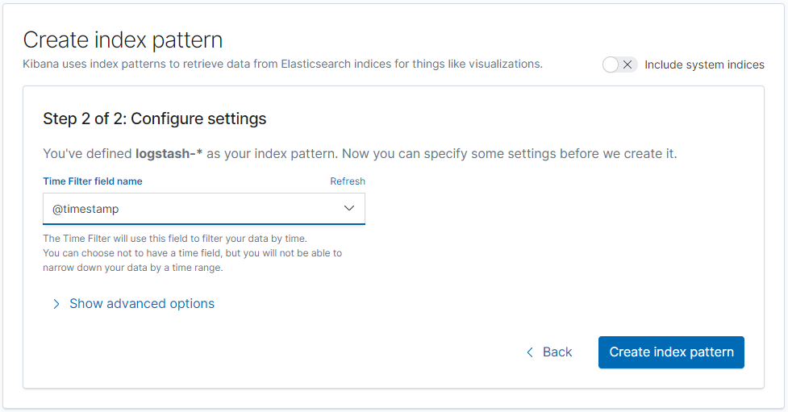
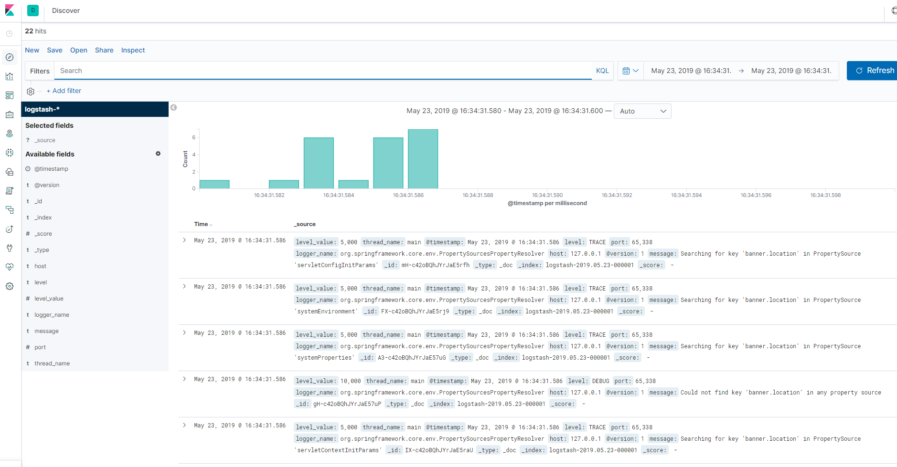

어플리케이션 수행 중 발생하는 예외(Exception)를 모니터링 할 수 있는 시스템을 위해 ELK를 로컬환경에 구성한다.

<!--more-->

## 구성
##### ELK
* Logstash : 데이터 수집, 필터링, Elasticsearch에 색인 (ETL 기능)
* Elasticsearch : 데이터 저장소 + 검색엔진
* Kibana : 수집 데이터 시각화

##### 적용
Logback Logstash용 Appender를 활용하여 WARN 이상 레벨의 로그를 Logstash에 적재 (https://jsonobject.tistory.com/243), Logstash에서 Elasticsearch로 색인
    * `LogstashEncoder`는 스프링앱에서 발생하는 로그를 ELK스택에서 사용되는 JSON형태로 변환
    * `LogstashSocketAppender`는 Logstash 서버에 로그 전송 

```uml
WAS -> Logstash: 수집
Logstash -> Elasticsearch: 색인
Elasticsearch -> Kibana: 시각화
```


## Logstash
* 공식 홈페이지 : https://www.elastic.co/kr/products/logstash
* 설치 : https://www.elastic.co/kr/downloads/logstash

##### 디렉토리 구성


테스트를 위해 표준 입출력 (터미널 입력, 출력)으로 설정하고 실행

##### 테스트 진행
1) 설치경로/config/logstash-example.conf 파일 생성하고 아래와 같이 입력
```conf
input {
    stdin {}    // 표준 입력
}
output {
    stdout {}   // 표준 출력
}
```
2) 실행
```bash
cd 설치경로/bin
logstash ../config/logstash-example.conf
```


##### Spring Boot와 연동
1) logstash Input 설정에 아래와 같이 설정
```conf
# 입력은 TCP 4560포트로, 출력은 표준 출력 사용
input {
    tcp {
        port => 4560
        codec => json_lines
    }
}
output {
    stdout {}   // 표준 출력
}
```

2) Spring Boot pom.xml에 logstash appender 디펜던시 추가
```xml
<dependency>
    <groupId>net.logstash.logback</groupId>
    <artifactId>logstash-logback-encoder</artifactId>
    <version>4.11</version>
</dependency>
```

3) logback.xml에 Logstash Appender 추가
```xml
<!-- logstash 4560포트 설정에 맞춰 설정 -->
<appender name="LOGSTASH" class="net.logstash.logback.appender.LogstashTcpSocketAppender">
    <destination>127.0.0.1:4560</destination>
    <encoder class="net.logstash.logback.encoder.LogstashEncoder"></encoder>
</appender>

<root>
    <level value="INFO"/>
    <appender-ref ref="LOGSTASH"/>
</root>
```

4) logstash, Spring Boot 각각 실행
아래와 같이 Spring Boot 실행 로그가 ELK 포맷에 맞는 JSON형태로 변환되어 표준출력으로 출력됨


##### 출력 Elasticsearch 와 연동 (input을 Elasticsearch로 적재)
1) logstash Input/Output 설정에 아래와 같이 설정
```conf
# 입력은 TCP 4560포트로, 출력은 표준 출력 사용
input {
    tcp {
        port => 4560
        codec => json_lines
    }
}
output {
    elasticsearch {
        hosts => ["localhost:9200"]    
        index => "logstash-%{+YYYY.MM.dd}"
    }
}
```

## Elasticsearch 
* 공식 홈페이지 : https://www.elastic.co/kr/products/elasticsearch
* 설치 : https://www.elastic.co/kr/downloads/elasticsearch

##### 디렉토리 구성


##### 실행
```bash
cd 설치경로/bin
elasticsearch
```

이후 http://localhost:9200 로 접속해봤을 때 페이지가 정상적으로 뜨는지 확인

## Kibana
* 공식 홈페이지 : https://www.elastic.co/kr/products/kibana
* 설치 : https://www.elastic.co/kr/downloads/kibana

##### 디렉토리 구성


##### 실행
```bash
cd 설치경로/bin
kibana
```
이후 http://localhost:5601 로 접속해봤을 때 페이지가 정상적으로 뜨는지 확인

##### Elasticsearch 연동
1. http://localhost:5601 접속 후 "Create index pattern" 클릭
2. Kibana에서 모니터링/분석할 Index의 패턴을 입력 (logstash에서 index패턴을 **"logstash-날짜"** 로 했기 때문에 아래와 같이 지정)

3. 로그 시간으로 사용할 필드 지정 (여기서는 logback logstash appender가 자동으로 생성해준 timestamp값 사용)

4. Spring Boot 어플리케이션의 로그가 잘 적재되었는지 확인


## 참고
* [Elastic Stack 공식 홈페이지](https://www.elastic.co/kr/products/)
* [Elastic Stack과 Lambda를 활용한 데이터 모니터링 시스템 구축](https://d2.naver.com/helloworld/9878588)
* [Spring + Logstash + Elasticsearch + Kibana 기본 셋팅](https://dev-t-blog.tistory.com/30)
* [ELK Stack 개념정리](https://heowc.tistory.com/49)
