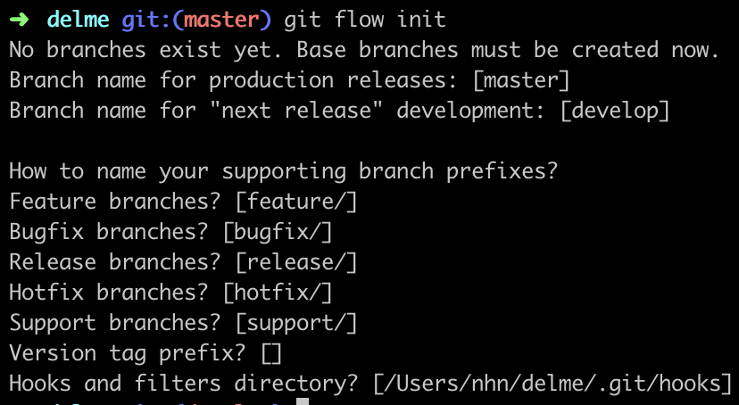

Git 고급 브랜치 전략 소개와 Gitflow를 통해 우리 프로젝트에 적용하는 방법에 대해 소개합니다.
<!--more-->

## Vincent Driessen 의 브랜치 모델
[Vincent Driessen가 제안한 고급 브랜치 전략](https://nvie.com/posts/a-successful-git-branching-model/)으로 브랜치를 다음과 같이 분류하고 규칙을 정해 버전관리를 합니다.

#### Main Branch


- master
	- 현재 릴리즈되어있는 버전 또는 바로 릴리즈가 가능한 다음 버전
	- master 브랜치에 merge 가 발생하는 것은 곧 신규 릴리즈가 있다는 의미
	- 발견된 모든 버그가 해결된, 정상적으로 동작하는 상태여야함
- develop
	- 다음 릴리즈를 위해 개발된 모든 기능들이 통합되어 관리되는 브랜치
	-  모든 개발자가 함께 관리하는 브랜치, 항상 컴파일이 가능한 상태를 유지

#### Supporting branch 
- feature
	- 특정 기능을 개발하는 브랜치
	- 일반적으로 담당 개발자 로컬에만 존재 (한 feature를 위해 여러 개발자와 협업하는 경우 origin 에 push 필요)
	- 기능개발 시작 시 develop 으로 부터 분기하고 개발이 완료되면 다시 develop 으로 Merge
	- 아주 간단한 수정 (side-effect가 없다고 확신하는 경우)은 별도 feature 브랜치 없이 develop 브랜치에서 바로 수정하는 것을 허용
- release
	- 다음 릴리즈를 준비하는 브랜치
	- 이 브랜치에서 실제 릴리즈 전 발견되는 버그 수정 등이 이루어짐
	- develop 으로 부터 분기하고 develop (bugfix 한 것들을 머지하기 위함), master(신규 기능 + bugfix) 로 merge
- hotfix
	- 운영중에 문제가 발생하는 경우 해당 문제를 수정하는 브랜치
	- master 로 부터 분기하며, 문제를 수정한 후 정상동작이 확인되면 develop과 master로 merge

## Gitflow 란?
위에서 소개한 브랜치 모델을 쉽고 편하게 사용할 수 있도록 지원하는 도구입니다.

## 설치
먼저 gitflow 를 설치합니다.

Mac 에서는 brew를 이용해 간단하게 설치할 수 있습니다.

```
# OSX
brew install git-flow-avh

# Linux
apt-get install git-flow
```

## 사용하기
#### 초기화
git repository에 gitflow 를 적용하기 위해 아래 명령어를 입력합니다.

```
git flow init
```



`git flow init` 명령을 실행하면 git repository 에 gitflow 브랜치 모델을 적용하기 위한 설정 절차를 진행합니다.

초기화가 완료되면 Main 브랜치인 master 와 develop 브랜치가 생성되어있습니다.

#### 신규 기능 개발
신규 기능 개발을 위해 develop 브랜치를 기준으로 분기하는 feature 브랜치를 구성해야합니다.
Gitflow 는 아래 명령어를 통해 진행할 수 있습니다.

```
git flow feature start name-of-feature
```
그럼 `feature/name-of-feature` 브랜치가 생성되며 기능 개발이 가능합니다.

기능 개발이 완료됐다면 커밋한 후 develop 브랜치에 머지를 해야하는데요.
Gitflow 는 아래 명령어로 가능합니다.

```
git flow feature finish name-of-feature
```


그럼 develop 체크아웃 -> feature/name-of-feature 브랜치 develop으로 머지 ->  feature/name-of-feature 제거 작업이 진행됩니다.

#### Release 하기
어느정도 기능이 준비되어 다음 릴리즈를 할 수 있는 수준에 도달하면 release 작업을 진행합니다.

```
git flow release start release-name
```

위 명령어는 release/release-name 으로 브랜치를 생성합니다.

이후 운영 배포 전 최종 점검, 발견되는 문제 수정을 진행 후 완전히 배포 준비가 마무리되면, master 에 merge 를 진행하고 develop 에도 Back merge를 해야하는데요.

이것 역시

```
Git flow release finish release-name 
```


명령어로 간단하게 진행할 수 있습니다.