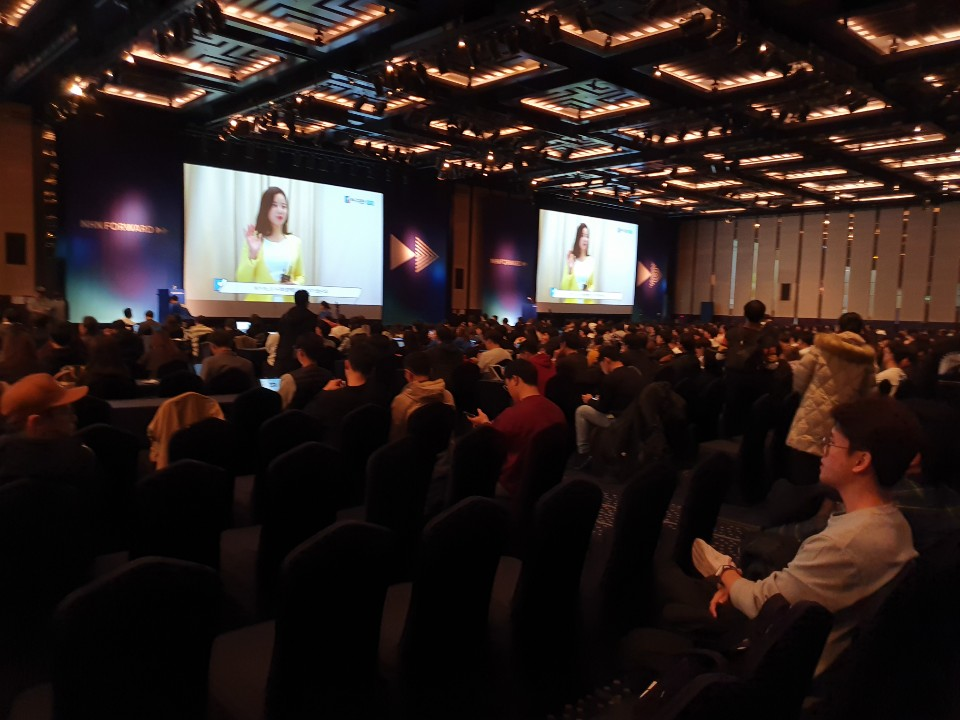
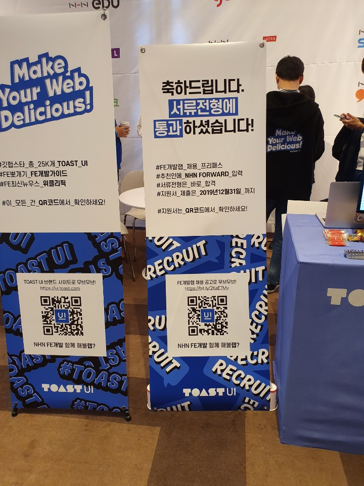
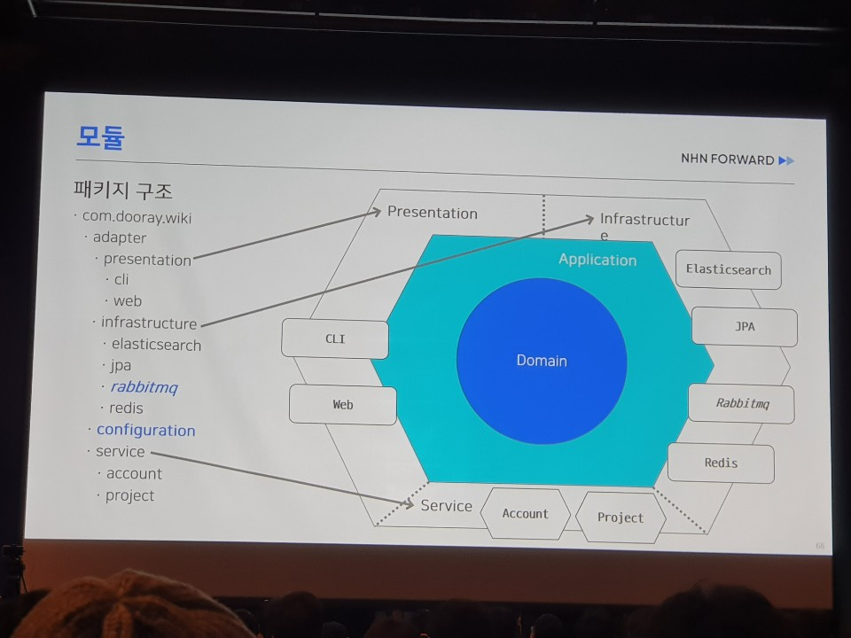
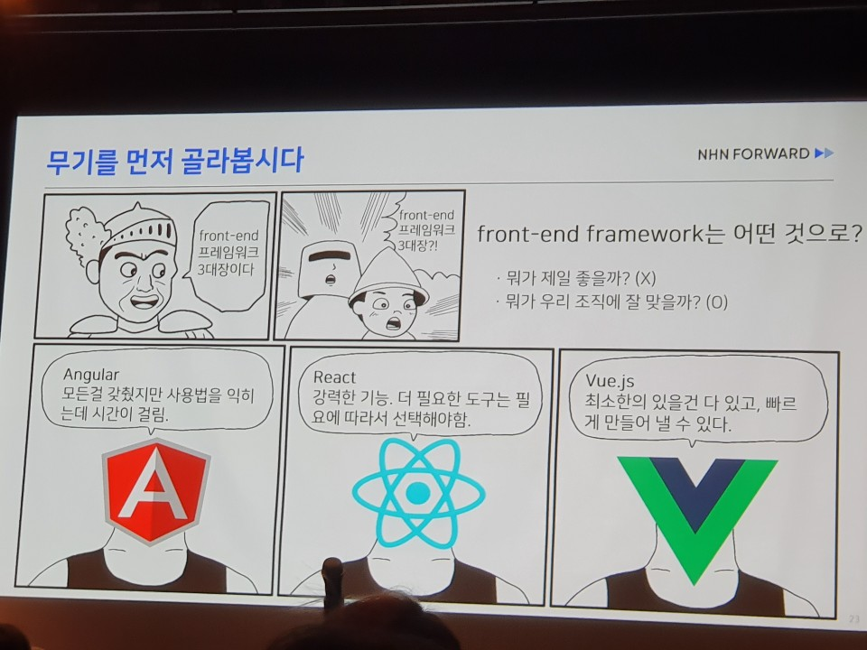
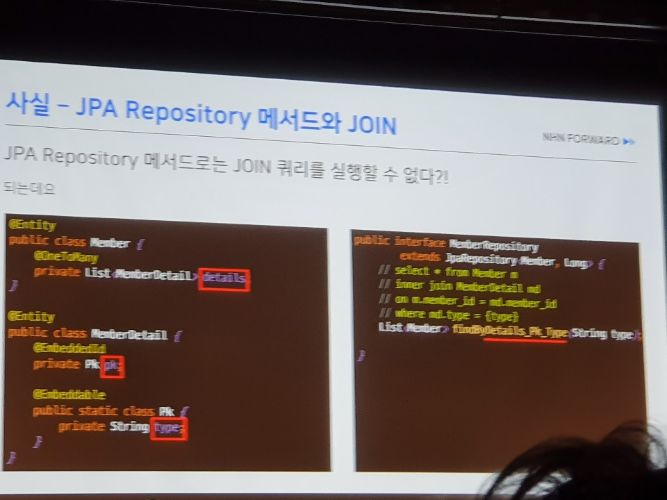
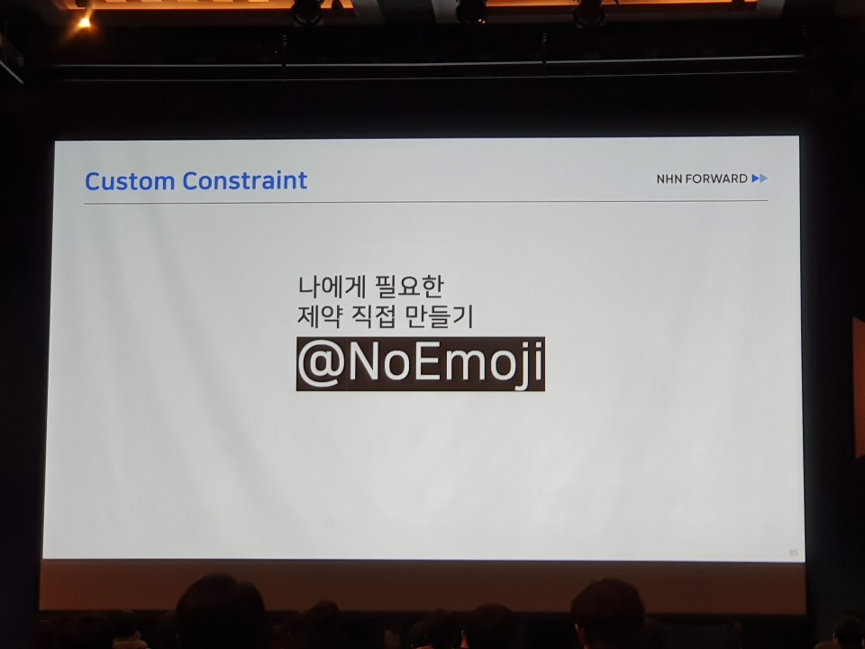
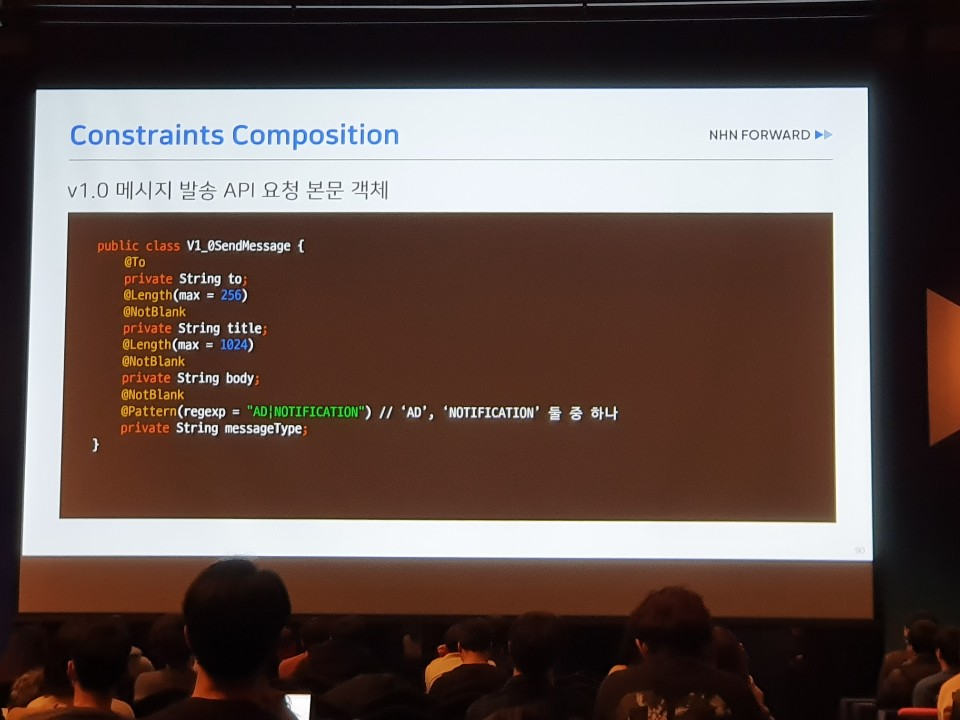
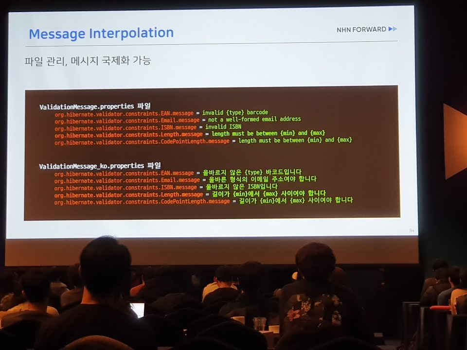
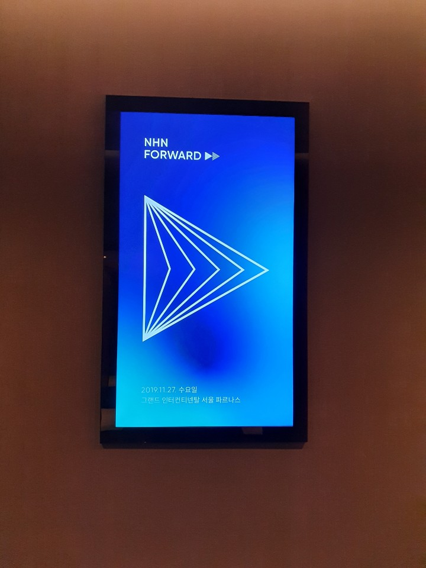

NHN Forward 2019 컨퍼런스 참여 후기입니다.

<!--more-->

## NHN Forward 2019
 
지난 11월 27일 `NHN Forward 2019` 컨퍼런스에 참가했습니다.
회사가 회사다 보니 다양한 컨텐츠들이 준비되어 있었는데요. 
크게 아래와 같았습니다.

1. 세션
    1. 발표세션
    2. 스몰 스텝
    3. 프런트엔드 상담소
    4. 커뮤니티 라운지
2. 워크숍
3. 핸즈온 랩

 

프론트엔드 전문 개발자분들이 직접 고민을 들어주고 대화를 할 수 있는 프런트엔드 상담소나 평소에 궁금했거나 해보고 싶었던 것들을 쉽게 따라해보고 경혐해 볼 수 있었던
핸즈온 랩 등 준비를 정말 많이 했다는 느낌이 들었습니다.

특히 발표세션에서는 실무에서 겪을수 있는 문제점들이나 겪었던 문제들을 사례를 많이 공유받을수 있어 유익한 시간이었습니다.

발표세션은 총 7개 트랙에서 시간대별로 각각 강의가 주로 진행되었는데요. 저는 아래와 같이 세션을 참여했습니다.

## 발표세션
#### 1. '깃'깔나는 Git 워크 플로우 알아보기
개발에 필수인 깃을 더 잘 쓰는 방법에 대해 사례를 통해 들을 수 있었습니다.
특히 전 GitFlow 이외에 깃헙 플로우, 깃랩 플로우가 있는 거는 처음알았습니다.

- 깃 플로우: 메인브랜치(master / develop)와 서포팅프랜치 (feature, release, hotfix) 을 활용한 깃 워크플로
- 깃헙 플로우: 깃 플로우가 대부분의 케이스에서 갖는 복잡함을 해소하고자 master / topic 브랜치를 활용해 간단하지만 강력한 워크플로
- 깃랩 플로우: 깃 플로우는 너무 복잡하고, 깃헙 플로우는 너무 단순하다. 절충안을 제안

#### 2. DDD-Lite@Spring
NHN의 서비스 중 Dooray! 의 위키 서비스를 사례로 애플리케이션의 복잡함으로 고통받는 개발자들을 위해 DDD를 소개하고, 어떻게 복잡함을 극복할 수 있는지 소개했습니다.

- DDD에서 모델링 시 속성보다는 행위가 우선이다.
- 속성은 어떤 행위를 할 때 필요하면 그 때 추가한다.
- JPA로 생각해보면 바로 양방향 매핑을 하지 않고 우선 단방향 매핑을 하고 필요 시 추가로 양방향 매핑을 한다.
- 도메인 모델을 풍부하게 만들어준다. (Rich Domain Model)
- 여러 변 연산을 적용해도 그 결과가 달라지지 않는 성질, 멱등성을 유지하도록 설계한다.
- 헥사고날 아키텍쳐

  

#### 3. 레거시 웹 서비스 길들이기: 서버 개발자의 SPA 적용기
저 또한 Spring 기반 웹 백엔드 애플리케이션을 만드는 개발자 다 보니 이 세션에서 소개해주신 사례들이 하나하나가 공감가는 사례들이었습니다.
제가 평소에 겪었던 고민들에 대한 해결책을 들을수있어 좋았습니다.

적용하기전의 고민 / 적용하면서의 고민 / 현재 팀의 상황 / 효율적인 빌드를 위한 프로젝트 구성 / API 호출 방식 with Zuul /상태관리 / 다국어처리 

  

#### 4. Spring JPA의 사실과 오해
Spring JPA에 평소에 잘 알려지지 않은 사실들과 오해들을 소개해주셨습니다.

- 연관관계: 대부분의 경우는 단방향 매핑이 간단, 하지만 영속성 전이를 사용하는 경우 양방향 매핑을 사용하자 (추가 update 쿼리 방지)
- JpaRepository에 대한 사실
    - JpaRepository를 상속하는 것만으로도 대부분의 왠만한 기능을 사용할 수 있다.
    - JpaRepository로도 JOIN이 가능하다.
    - JpaRepository로도 다양한 DTO Projection이 가능하다.

  

#### 5. Paas & API Experience: 좋은 API DX를 제공하기 위한 작은 걸음
 
 
 
 
## 마치며
  
NHN Forward 2019의 심볼인 >> 는 리달리디렉션 기호 >>를 형상화한 것으로 지식과 경험을 더하고 쌓을 수 있기를 바라는 마음을 담았다고 합니다.

이런 NHN의 의지만큼 많은 것을 경험하고, 배우고, 즐거웠던 1분 1초가 아깝지 않은 시간이었습니다.

감사합니다.
