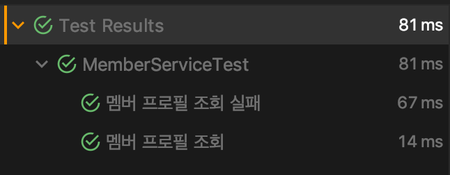

JUnit은 Java를 위한 단위 테스트 (Unit Test) 프레임워크로 개발하는 프로그램에 대한 테스트케이스를 쉽게 작성할 수 있도록 도와줍니다.
그동안 JUnit4를 주로 사용해왔는데, 최근들어 JUnit5가 있음을 알게되고(사실 나온지는 2년이 넘은..) 어떤 차이점이 있는지 알아보고 사용해보려합니다.

## JUnit4에서 JUnit5로 넘어오며 달라진 점
먼저 JUnit5를 사용하기 위해서는 아래 지원범위에 만족하는지 확인해봐야합니다.
- Java8 이상 지원
- IntelliJ IDEA 2016.2 이후 지원
- Eclipse Oxygen 이후 지원
- Kotlin 지원

JUnit5 User Guide 문서 첫 단락에 보면 다음과 같은 문구가 적혀있습니다.
> Unlike previous versions of JUnit, JUnit5 is composed of several different modules from three different sub-projects.

> JUnit5 = JUnit Platform + JUnit Jupiter + JUnit Vintage

이전 버전들과 달리 JUnit5 에 들어서며 여러 개의 서브 모듈로 나뉘었다는 것입니다.

#### \# JUnit Platform
JUnit Platform은 Test를 실행하기 위한 전반적인 사항들을 제공하는 역할입니다. 테스트케이스를 발견, 실행하고 결과를 보고해주는 일종의 컨텍스트라는 생각이 듭니다.
JUnit Platform은 어떻게 테스트를 발견하고 실행하고 보고할 지에 대한 실제 동작은 `TestEngine` 인터페이스를 구현하여 정의되며 실제 구현체들은 별도 모듈로 존재합니다.

#### \# JUnit Jupiter
JUnit Jupiter는 `TestEngine`을 구현한 엔진입니다. (jupiter-engine) Jupiter API는 JUnit5에 새롭게 추가된 API들을 포함하고 있습니다.

#### \# JUnit Vintage
JUnit Vintage는 기존 JUnit4 버전으로 작성된 테스트를 실행하기 위한 엔진입니다. (vintage-engine)

참고로 Spring Boot 2.2.0 버전부터 JUnit5가 기본으로 채택되었는데요.
`Spring Initializer`를 통해 프로젝트를 만들어보면 Test 디펜던시가 다음과 같이 되어있는것을 볼 수 있습니다.
```xml
...
<dependency>
  <groupId>org.springframework.boot</groupId>
  <artifactId>spring-boot-starter-test</artifactId>
  <scope>test</scope>
  <exclusions>    
    <exclusion>
      <groupId>org.junit.vintage</groupId>
      <artifactId>junit-vintage-engine</artifactId>
    </exclusion>
  </exclusions>
</dependency>
...
```
`junit-vintage-engine` 모듈을 제외하고 있습니다. `vintage-engine` 자체가 JUnit4를 지원하기 위한 모듈이다보니 기본적으로는 제외하도록 설정되는 것입니다.

만약 JUnit4 테스트케이스를 같이 관리해주어야하는 상황이라면 위 `exclusion` 설정을 삭제하면 됩니다.

## 새로운 혹은 변경된 기능
아키텍쳐는 많이 바뀌었지만 실제 테스트케이스를 작성하는 부분에서는 크게 바뀐 점은 느껴지지 않습니다.

주로 기존에 사용되던 어노테이션들의 네이밍이 좀 더 명확해지는등의 차이점이 눈에 띕니다.

#### 1. @DisplayName
기존에 테스트 결과가 보고될 때 메소드명이 테스트케이스 이름으로 사용되었는데요. 때문에 테스트케이스를 잘 설명하기 위해 한글로 하고는 했습니다.

JUnit5에서는 `@DisplayName` 어노테이션을 활용해 좀 더 깔끔하게 이름을 붙혀줄 수 있습니다.

```java
public class MemberServiceTest {

  // 기존 방식
	@Test
	public void 멤버_프로필_조회() {
		...
	}

  // JUnit5 방식
  @Test
  @DisplayName("멤버 프로필 조회")
  public void getMemberProfileTest() {    
		...    
  }
}
```



#### 2. @Disabled
기존 `@Ignore` 어노테이션을 대체하는 어노테이션입니다.

#### 3. LifeCycle Hook
JUnit 테스트케이스 작성 시 개발자가 테스트 수행 전 후 특정 시점에 실행될 동작을 정의할 수 있습니다.

기존에는 `@BeforeClass`, `@AfterClass`, `@Before`, `@After` 어노테이션을 활용했었는데요.

JUnit5에서는 `@BeforeAll`, `@AfterAll`, `@BeforeEach`, `@AfterEach` 로 변경되었습니다. @Before와 @After는 기존에 (테스트케이스 마다)라는 의미가 없어서 혼동의 여지가 있었는데, 변경된 네이밍은 이를 잘 표현하고 있어 마음에 듭니다.

#### 4. assertAll with Lambda
테스트에서 assertion종류가 많고 복잡한 경우 `assertAll(Executable...executables)`을 이용할 수 있습니다.
`Executable`은 파라미터와 반환값이 없는 함수형 인터페이스이기 때문에 assertAll로 그룹핑 + assertion을 람다로 작성할 수 있습니다.
```java
assertAll("assertionGroup1",
  () -> assertEquals(expected, actual),
  ...	
)
```

#### 5. @ParameterizedTest
한 메소드에서 여러 종류의 파라미터를 받아 테스트를 수행할 수 있습니다.

```java
@DisplayName("공백 문자열 테스트")
@ParameterizedTest(name = "문자열 {0}으로 조회")
@ValueSource(strings = " ", "")
public void isBlankStringTest(String source) {
  boolean isBlank = service.isBlank(source);
  assertTrue(isBlank);
}
```

참고로 @ParamterizedTest를 사용하려면 `junit-jupiter-params` 모듈을 추가해야합니다.
- maven
```xml
<dependency>
    <groupId>org.junit.jupiter</groupId>
    <artifactId>junit-jupiter-params</artifactId>
    <version>VERSION_TO_USE</version>
    <scope>test</scope>
</dependency>
```
- gradle
```gradle
testCompile group: 'org.junit.jupiter', name: 'junit-jupiter-params', version: 'VERSION_TO_USE'
```

이외에 더 자세히 알아보고싶으면 [JUnit5 공식 홈페이지](https://junit.org/junit5/)를 방문해보시는 것을 추천드립니다.
