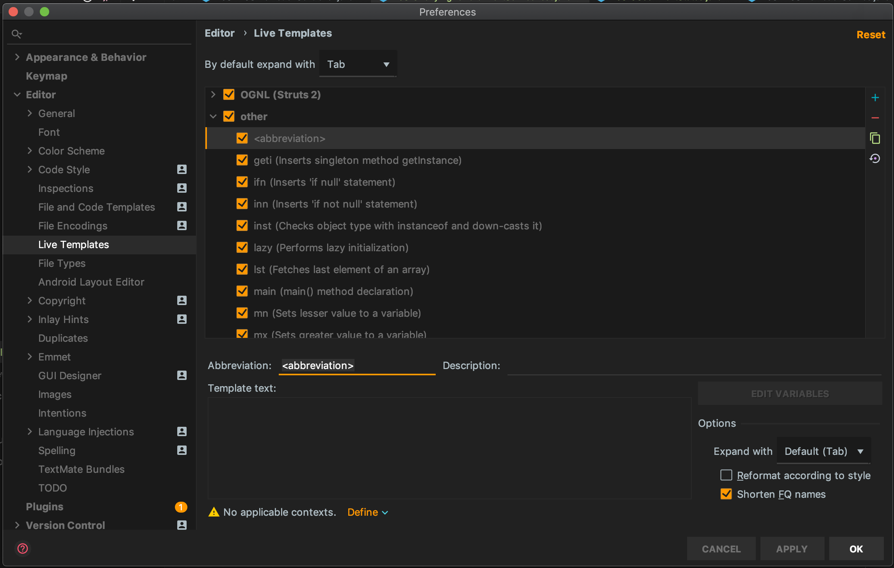
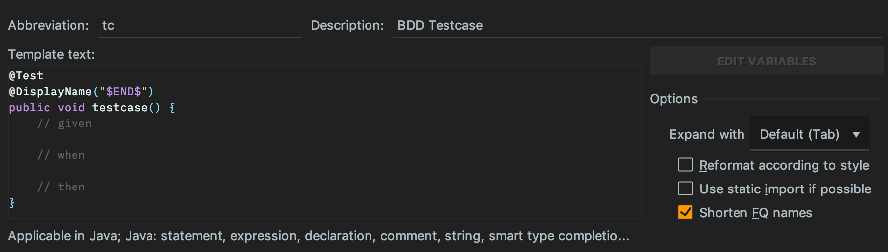

이번 포스트에서는 IntelliJ에서 유용하게 사용할 수 있는 커스텀 Live Template을 추가하는 방법을 소개합니다.

## Live Template 기능 소개
Live Template 은 간단한 약어로 예약된 코드를 Generate 해주는 유용한 기능인데요.

예를들어 코드 편집창에서 `main`이라 치면

```java
public static void main(String[] args) {

}
```

이렇게 메인 메소드가 Generate됩니다.

IntelliJ의 Preferences > Editor > Live Templates 에서 제공되는 Live Template들을 확인할 수 있습니다.

## 커스텀 Live Template 추가
Preferences > Editor > Live Templates 메뉴 우측에 + 버튼을  클릭하여 라이브 템플릿을 추가합니다. 



위 항목들을 설명드리면

- `Abbreviation`은 Live Template의 약어
- `Description`은 해당 Live Template에 대한 설명
- `Template text`는 약어를 통해 Generate할 실제 코드
- 하단부에 `Define` 버튼을 클릭하여 Live Template이 활성화될 컨텍스트를 지정합니다.

자바 파일에서 `tc`라는 약어를 사용해 하나의 테스트 메소드를 generate하는 추가해보겠습니다.



Template text에서 `$END$`는 코드가 generate된 후 커서가 이동될 위치를 지정해주는 것입니다.


이렇게 Live Template을 이용해 빈번하게 반복되는 작업을 줄여 보다 생산성을 높힐수 있는거 같습니다.
