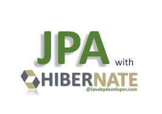

보통 시스템에 필요한 테이블을 설계하면 이력 관리 등의 목적으로 row 생성시간, 수정시간을 저장할 컬럼 두는 경우가 많습니다.
JPA를 통해 해당 테이블들을 엔티티로 매핑하면 여러 테이블에 걸쳐 중복코드가 발생할 수 있습니다.
첫 째로는 각 엔티티에 생성 / 수정 시간을 매핑할 필드를 선언해줘야하고, 
두 번째로는 특정 엔티티가 생성, 수정 될 때 해당 필드의 값에 현재시간 값으로 세팅해주는 코드가 필요하게 되는 점입니다.

이번 글에서는 Spring Data JPA 환경 제공하는 Audit 기능을 통해 이 컬럼들을 효율적으로 매핑할 수 있는 방법들을 소개합니다.

## Spring Data JPA Auditing
Audit 기능은 엔티티에 발생하는 변경사항을 추적하는 기능을 구현하는데 도움을 줍니다.

#### 1. Auditing 활성화
`@EnableJpaAuditing`으로 Auditing 기능을 활성화합니다.
```java
@EnableJpaAuditing
public class Application {
  // ... 생략
}
```

#### 2. EntityListener 설정 및 BaseEntity 생성
`EntityListener`는 Entity가 DB로 load / persist되기 전후에 커스텀 로직을 선언하는 인터페이스입니다.
커스텀 리스너를 구현 후 `@EntityListeners`를 통해 해당 엔티티에 등록해줄 수 있는데, 
이번 예제에서는 Spring에서 제공하는 구현클래스인 `AuditingEntityListener`라는 Auditing기능을 수행하는 리스너를 등록했습니다.

`AuditingEntityListener`는 해당 엔티티에 선언된 `CreatedDate`, `LastModifiedDate`, `CreatedBy`, `LastModifiedBy` 어노테이션을
탐색해 엔티티 변경 시 해당값을 자동으로 업데이트 해줍니다. 이 예제에서는 `CreatedDate`, `LastModifiedDate`만 사용했습니다.

`@MappedSuperClass`는 해당 클래스가 상속될 속성을 포함하고 있는 SuperClass 라는걸 알리는 마커 어노테이션입니다.

```java
@EntityListeners(value = {AuditingEntityListener.class})
@MappedSupperClass
public abstract class BaseEntity {
    @CreatedDate
    @Column(nullable = false)
    private LocalDateTime createdAt;               

    @LastModifiedDate                                   
    @Column(nullable = false)
    private LocalDateTime updatedAt;

    // getter 등 기타 코드 생량
}
```

#### 3. 실제 엔티티 구현
이제 2번에서 구현한 BaseEntity를 실제 엔티티에 상속받기만 하면 생성시간, 수정시간 속성을 포함하며 해당 값이 자동으로 업데이트되는 기능까지 포함된 효과를 얻게 됩니다.
```java
@Entity
@Table(name = "user")
public class UserEntity extends BaseEntity {
    // 생략
}
```

이렇게 간단하게 Auditing 기능을 통해 생성시간 수정시간을 자동으로 설정해봤습니다.
상속을 통해 중복되는 속성을 제거했고, AuditingEntityListener를 통해 지루하고 중복되는 값 설정해주는 로직을 제거할 수 있었습니다.